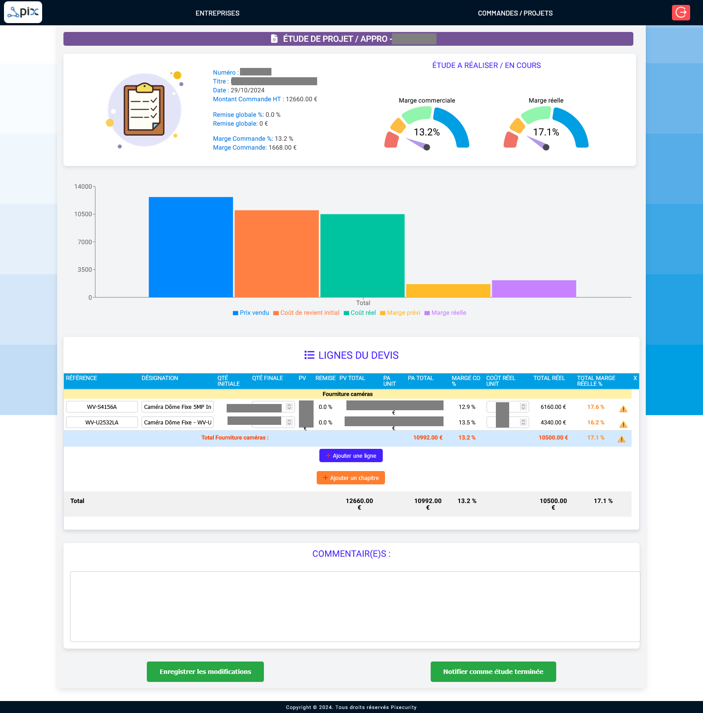

## Pix x Axo - Application de Gestion des Devis et Marges connecté à Axonaut

Cette application web est conçue pour optimiser la gestion des devis, commandes et marges commerciales en intégrant les données de l'API Axonaut. Elle permet d'automatiser l'analyse des projets, de suivre les dépenses réelles et à venir, et d'optimiser la gestion des marges commerciales et réelles.

## Table des matières

- [Fonctionnalités](#fonctionnalités)
- [Connexion avec Axonaut](#connexion-à-axonaut)
- [Technologies utilisées](#technologies-utilisées)
- [Screenshots](#screenshots)

## Fonctionnalités

L'application offre les fonctionnalités suivantes :

- Connexion à une API Node.js pour récupérer en temps réel les données de l'API Axonaut.
- Suivi des dépenses réelles et prévisionnelles associées aux projets.
- Calcul des marges commerciales et réelles afin d'optimiser la rentabilité des commandes.
- Duplication des devis Axonaut pour étudier l'approvisionnement et la gestion de projet.
- Visualisation graphique des données à l'aide de tableaux de bord et graphiques interactifs.
- Gestion des chapitres et articles d'un devis avec calcul automatique des sous-totaux et marges par section.
- Système de commentaires et suivi pour chaque projet afin d'assurer une meilleure gestion collaborative.
- Exportation et sauvegarde des études pour archivage et partage facile.

## Connexion avec Axonaut

L'application ne se connecte pas directement à Axonaut, mais utilise une API intermédiaire basée sur Express et Node.js. Cette API :

- Gère les requêtes et l'authentification avec Axonaut
- Permet d'importer en temps réel les devis, commandes, dépenses et clients.
- Récupère les informations financières et historiques des projets.
- Synchronise les marges commerciales et dépenses avec les données Axonaut.

## Technologies utilisées

L'application repose sur les technologies suivantes :

**Frontend :**
- **React.js** avec Hooks et Context API
- **SCSS** pour le style et la mise en page responsive
- **Recharts** pour la visualisation des données sous forme de graphiques
- **React-toastify** pour les notifications
- **React-spinners** pour l'affichage du chargement
- **SweetAlert2** pour les pop-ups interactifs
- **Framer Motion** pour les animations

**Backend & Base de données :**
- **Firebase Firestore** pour la gestion des données et documents
- **Firebase Auth** pour l'authentification des utilisateurs
- **Firebase Storage** pour le stockage des fichiers
- **API Axonaut** pour la synchronisation des devis et commandes

## Screenshots

 

